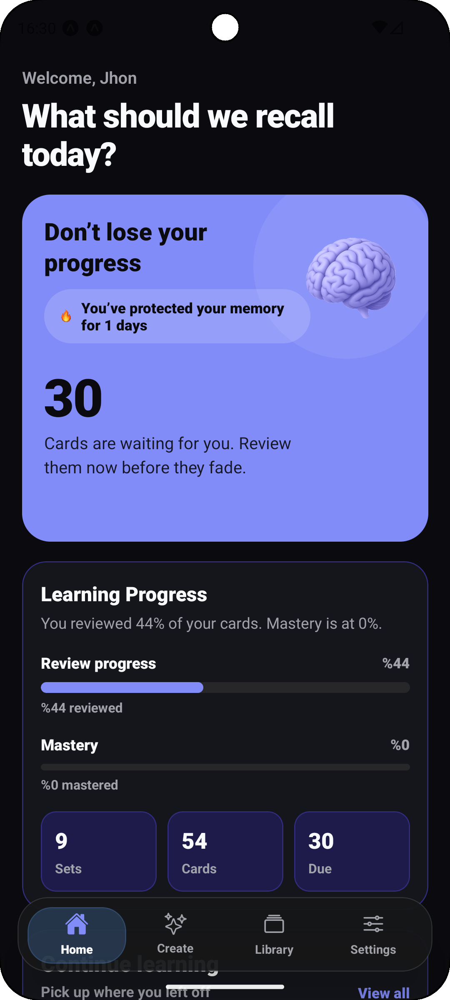
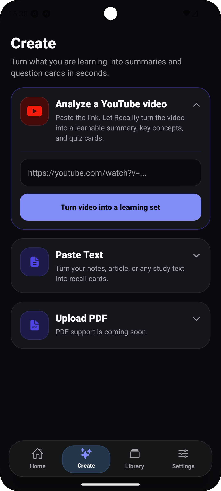
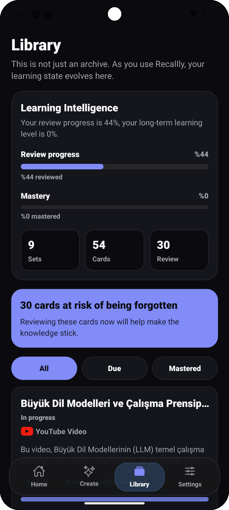
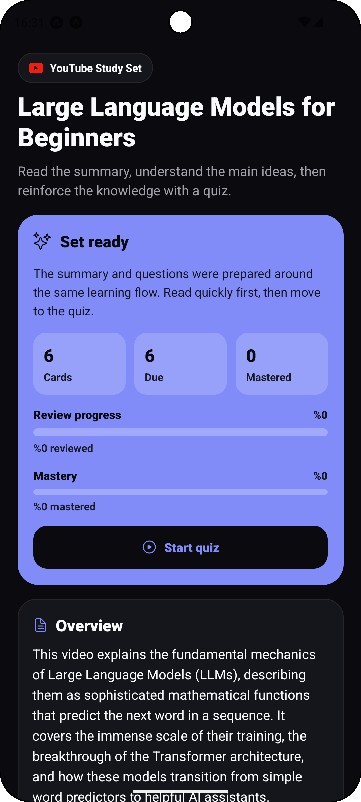
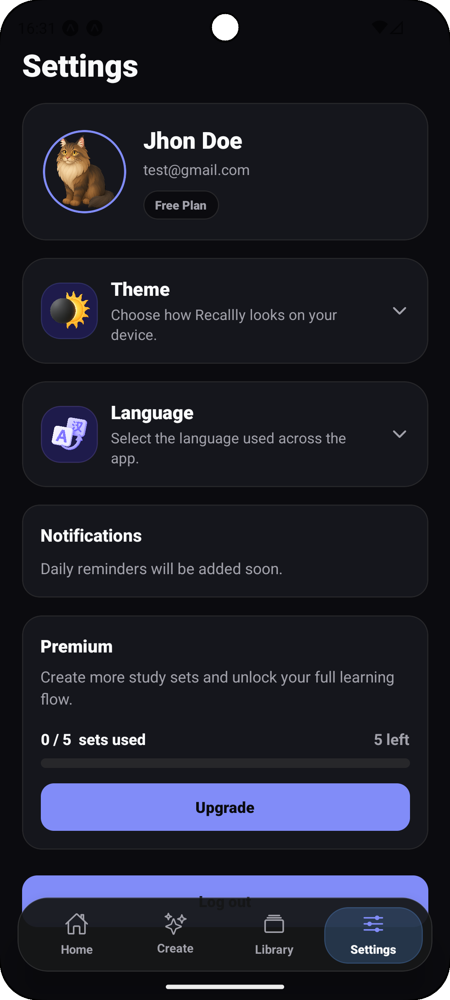

# Recallly

**Turn anything you learn into AI-generated review cards.**

Recallly is a mobile learning app built with Expo and React Native that turns raw study material into structured review sets. Users can paste a YouTube link or a text-based learning source, let AI generate a study summary plus review cards, and then come back later to review due cards through a spaced-repetition flow.

At its core, the product is designed around a simple loop:

**Content -> AI Cards -> Review -> Return**

## Overview

Recallly helps learners convert passive content into an active review system.

- A user adds a learning source from the Create screen.
- The app sends that source into an AI processing flow.
- Recallly generates a structured summary, key concepts, and a fixed set of review cards.
- The finished set is saved to the user's library in Firestore.
- The learner reviews cards when they become due and gradually builds retention over time.

From the current codebase, Recallly supports two real content inputs:

- **YouTube links**
- **Free-form text content**

PDF import already appears in the UI, but it is currently marked as **coming soon** rather than implemented.

## Key Features

- **Authentication**
  Email/password registration, login, logout, and forgot-password flows are implemented with Firebase Authentication.

- **Onboarding**
  First-launch onboarding includes a language selection step and guided intro slides before the auth flow begins.

- **Home dashboard**
  The Home screen shows total sets, total cards, due cards, review progress, mastery progress, streak count, and quick access to recent sets or the next due review.

- **Create / add content flow**
  Users can create study sets from YouTube URLs or text input. Text generation is guarded by minimum-length validation, and YouTube URLs are validated before submission.

- **AI-generated summaries and cards**
  Completed sets contain:
  - a structured summary overview
  - section-based explanations with bullet points
  - key takeaways
  - key concepts
  - AI-generated review cards

- **YouTube processing flow**
  YouTube set creation is asynchronous. The app creates a `processing` set first, then a Firebase Cloud Function analyzes the video with Gemini, generates summary data plus multiple-choice cards, writes card documents, and marks the set as `completed` or `failed`.

- **Text content processing flow**
  Text input follows the same async job pattern: create a `processing` set, run AI generation in Cloud Functions, save the generated content to Firestore, then move the set to `completed` or `failed`.

- **Library screen**
  The Library screen lists study sets, exposes filters like all / due / mastered, and surfaces learning intelligence metrics such as review and mastery progress.

- **Set detail screen**
  Each set has a dedicated detail screen with three state-specific experiences:
  - `processing`: animated progress UI and leave-with-notification guidance
  - `completed`: summary, key concepts, progress, source preview, and review entry point
  - `failed`: saved source preview, error messaging, retry, and delete actions

- **Review flow**
  Review sessions load only due cards for a set. The review UI supports both:
  - **multiple-choice cards** for YouTube-generated sets
  - **basic question/answer cards** for text-generated sets

- **Spaced repetition / due cards logic**
  Due cards are queried from Firestore using `nextReviewAt <= now`.
  - If the user marks a card as known, the next interval progresses through `1 -> 3 -> 7 -> 14 -> 30` days.
  - Cards become `mastered` when the interval reaches at least 7 days and the user has answered correctly enough times.
  - If the user forgets a card, the interval resets to 1 day and the card remains in learning status.

- **Progress and stats recomputation**
  After each review result, Recallly recomputes set-level stats such as:
  - due count
  - mastered count
  - reviewed count
  - review progress
  - mastery progress
  - learning/new card counts

- **Daily streak tracking**
  Completing a review session updates a per-user review streak stored in Firestore.

- **Processing and failure states**
  The app explicitly models set lifecycle states with Firestore-backed `processing`, `completed`, and `failed` statuses.

- **Notifications**
  Recallly uses Expo Notifications to inform the user when a processing set finishes successfully or fails, even if they leave the detail screen.

- **Turkish / English i18n**
  The app ships with `tr` and `en` translation resources and stores the selected language in AsyncStorage.

- **Light / dark theme support**
  A custom theme provider supports light and dark UI modes across the app.

- **Settings screen**
  Settings includes:
  - profile information
  - language switching
  - theme switching
  - notification settings area
  - premium/plan card
  - logout

- **Firebase / Firestore-based data layer**
  Recallly uses Firebase Authentication, Firestore, Cloud Functions, and Storage initialization. The app also supports local Firestore and Functions emulators in development.

## AI Generation Flow

The AI pipeline in the current project is built around Firebase Cloud Functions and Gemini:

1. The client creates a new set job with either `createYoutubeSetJob` or `createTextSetJob`.
2. A Firestore document is created under `users/{uid}/sets/{setId}` with `status: "processing"`.
3. A Firestore-triggered Cloud Function detects the new processing set.
4. Gemini generates:
   - a title
   - a structured summary
   - key concepts
   - exactly 6 review cards
5. Card documents are written into `users/{uid}/sets/{setId}/cards`.
6. The parent set document is updated with computed counts and marked `completed`.
7. If generation fails, the set is marked `failed` with an error message.

Current generation behavior differs by source type:

- **YouTube sets** generate 6 **multiple-choice** cards with 4 options each.
- **Text sets** generate 6 **basic recall** cards with question, answer, and explanation.

## Firebase Data Model

Based on the current implementation, Recallly stores data primarily under:

```text
users/{uid}
users/{uid}/sets/{setId}
users/{uid}/sets/{setId}/cards/{cardId}
```

At a high level:

- `users/{uid}` stores account/profile metadata such as plan, streak count, language, and reminder-related fields.
- `sets/{setId}` stores source info, AI output, processing status, summary data, key concepts, and aggregated review stats.
- `cards/{cardId}` stores the review payload and spaced-repetition metadata like `reviewCount`, `knewCount`, `forgotCount`, `intervalDays`, and `nextReviewAt`.

## Tech Stack

- **Expo + React Native**
- **Expo Router**
- **TypeScript**
- **Firebase Authentication**
- **Cloud Firestore**
- **Firebase Cloud Functions**
- **Expo Notifications**
- **i18next / react-i18next**
- **NativeWind**
- **Gemini API** via Firebase Functions

## Screenshots

### Home


### Create


### Library


### Set Detail


### Settings


## Project Structure

```text
app/                     Expo Router screens
  (auth)/                Login, register, forgot password
  (tabs)/                Home, create, library, settings
  onboarding/            First-run onboarding flow
  set/[setId]/           Set detail and review screens

src/components/          Reusable UI and screen-specific components
src/context/             Auth, alerts, processing watcher providers
src/i18n/                Localization setup and translation resources
src/services/            Firebase, auth, cards, set stats, notifications, jobs
src/theme/               Theme provider and color system
src/utils/               Review interval helpers

functions/src/           Firebase Cloud Functions and AI generation logic
global/                  README screenshots
```

## Getting Started

### 1. Install dependencies

```bash
npm install
cd functions
npm install
```

### 2. Configure environment variables

The app expects Expo public Firebase variables in the root environment file, including:

```bash
EXPO_PUBLIC_FIREBASE_API_KEY=
EXPO_PUBLIC_FIREBASE_AUTH_DOMAIN=
EXPO_PUBLIC_FIREBASE_PROJECT_ID=
EXPO_PUBLIC_FIREBASE_STORAGE_BUCKET=
EXPO_PUBLIC_FIREBASE_MESSAGING_SENDER_ID=
EXPO_PUBLIC_FIREBASE_APP_ID=
EXPO_PUBLIC_FIREBASE_MEASUREMENT_ID=
EXPO_PUBLIC_USE_FIREBASE_EMULATOR=
```

Cloud Functions also require a Gemini API key:

```bash
GEMINI_API_KEY=
```

### 3. Run the app

```bash
npx expo start
```

### 4. Optional: run against Firebase emulators

The client code supports local Firestore and Functions emulators when:

```bash
EXPO_PUBLIC_USE_FIREBASE_EMULATOR=true
```

## Current Notes

- YouTube and text generation are implemented and wired into the app.
- PDF import is visible in the UI but not implemented yet.
- Theme switching exists in-app, but the current provider does not persist theme mode between launches.
- Language selection is persisted with AsyncStorage.

## License

This project currently does not declare a license in the repository.
